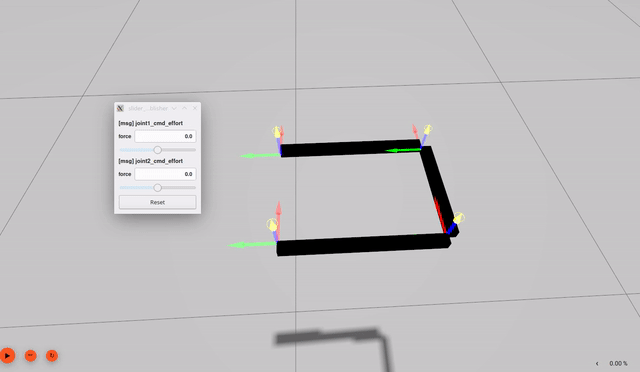
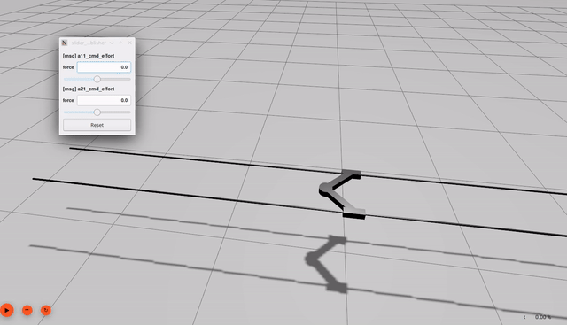

# Closed kinematic chains in Gazebo Sim

This package shows how to get a parallel robot working in Gazebo Sim. The provided launch file requires `simple_launch` and `slider_publisher`.

```bash
sudo apt install ros-${ROS_DISTRO}-simple-launch ros-${ROS_DISTRO}-slider-publisher
```

## Overall approach

Contrary to Gazebo classic, Gazebo Sim does not handle closed kinematic chains *in the SDF file*.
Actually what is not authorized is a link having two parents (which is necessary for a closed chain, but may also be a non-closed chain).

In order to obtain a closed chain, the SDF must thus describe the robot as a tree, where all links are correctly placed.
This can be done manually with a plugin, or automatically with the `unroll_loops` executable.

### DetachableJoint

This plugin is already part of Gazebo and is designed to attach or detach a joint between two models. In our case we only attach it, and we use it on the same model:

```xml
<plugin filename="libgz-sim-detachable-joint-system.so" name="gz::sim::systems::DetachableJoint">
  <parent_link>link_CD</parent_link>
  <child_model>four_bar</child_model>  <!-- of course I know him, it's me -->
  <child_link>link_CD_closing</child_link>
  <attach_topic>close_loop</attach_topic>
</plugin>
```

### AttachLinks

A custom plugin is also provided in this package, namely `AttachLinks`. This one only takes the two link names:

```xml
<!--plugin filename="libattach-links.so" name="gz::sim::systems::AttachLinks">
  <parent>link_CD</parent>
  <child>link_CD_closing</child>
</plugin-->
```


### SDF pre-parsing

The `unroll_loops` executable takes in a SDF file, possibly with closed kinematic chains. It will cut them and add `DetachableJoint` plugins to close the loops at runtime. See `robot_launch.py` for an example:

```bash
ros2 launch gz_attach_links robot_launch.py robot:=biglide_closed
```

Arguments are:

  - `-f <file>`: input sdf file (default: none)
  - `-n <name>`: spawned model name (default: name in file)
  - `-o <output>`: name of the output file. If loops are detected then a new SDF file will be written with plugins instead of closed chains
  - `-v <version>`: SDFformat version, if not given will use `gz sdf --versions` to find one

## Robot examples

Three examples are given, see the `model` folder and the launch file.

- a four bar from the [Gazebo classic example](https://classic.gazebosim.org/tutorials?tut=kinematic_loop&cat=)



- and a biglide that we use for teaching




